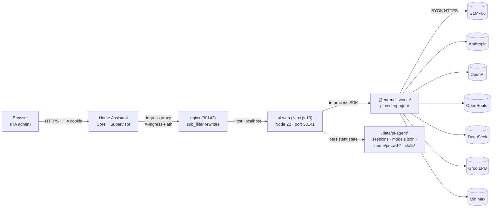
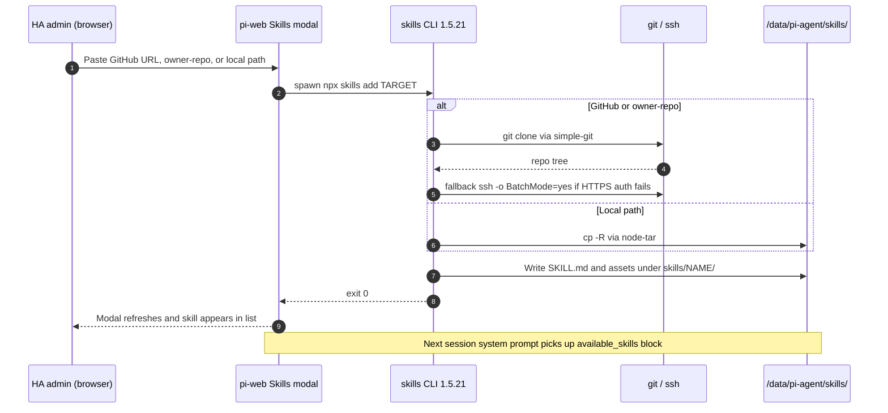
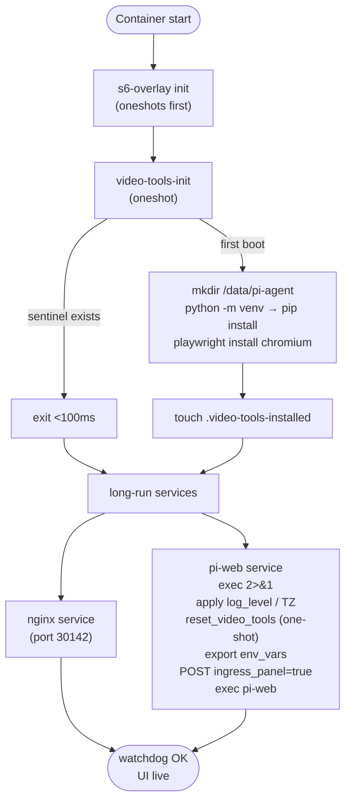

<p align="center">
  
</p>

<h1 align="center">Woow HA Pi Agent Add-on</h1>

<p align="center">
  <b>The <a href="https://github.com/agegr/pi-web">pi-web</a> workspace, packaged as a Home Assistant Supervisor add-on with the full <code>pitch_video</code> pipeline baked in.</b><br/>
  <sub>AI providers (GLM · MiniMax · OpenAI · OpenRouter · Anthropic · DeepSeek · Groq · …) configured <b>inside pi-web</b> — no HA config edit, no restart.</sub>
</p>

<p align="center">
  <a href="https://github.com/WOOWTECH/Woow_ha_pi_agent_add_on/releases"></a>
  
  
  
  
  
  
</p>

<p align="center">
  <a href="#quick-start">Quick Start</a> ·
  <a href="#features">Features</a> ·
  <a href="#architecture">Architecture</a> ·
  <a href="#screenshots">Screenshots</a> ·
  <a href="#configuration">Configuration</a> ·
  <a href="#skills-system">Skills</a> ·
  <a href="#related-packages">Packages</a> ·
  <a href="#security">Security</a> ·
  <a href="#troubleshooting">Troubleshooting</a> ·
  <a href="README_zh-TW.md">中文文件</a>
</p>

---

## Overview

**Woow HA Pi Agent** is a single Home Assistant Supervisor add-on that ships [`@agegr/pi-web`](https://www.npmjs.com/package/@agegr/pi-web) — the browser workspace for the [pi coding agent](https://github.com/earendil-works/pi) — plus the full video-production pipeline. Install once, open the sidebar tile, add your providers from inside pi-web, and every HA admin gets a per-session choice of model.

- **Zero-port install.** UI runs behind HA Ingress; no LAN/firewall changes.
- **BYOK inside pi-web.** Add providers from the Models panel — no addon restart, no HA config edit. Since v0.13.0 the addon Configuration tab only holds container-level knobs (log level, timezone, video-tools reset, env-var escape hatch).
- **State survives updates.** Sessions + models + skill worktrees + provider keys live under `/data/pi-agent/` and ride HA snapshots.
- **Skill store built in.** Add skills from GitHub URLs, `owner/repo` shorthand, or local paths straight from the UI (v0.12.0 shipped `git`+`openssh-client` so this works out of the box).
- **Video-production pipeline.** ffmpeg + Playwright + edge-tts + rclone all pre-installed for the `pitch_video` workflow (v0.11.0). One-shot re-download switch in Configuration (v0.13.0).
- **Watchdog.** Supervisor probes `/api/home`; hangs auto-restart.

## Quick Start

| Step | Action |
|---:|---|
| 1 | **Settings → Add-ons → Add-on Store → ⋮ → Repositories** |
| 2 | Add `https://github.com/WOOWTECH/Woow_ha_pi_agent_add_on` and install **Woow HA Pi Agent** |
| 3 | **Start** — leave Configuration on defaults, or tweak `log_level` / `timezone` |
| 4 | Open the **Pi Agent** entry from the HA sidebar (admins only) → **Models** panel → add a provider + paste its key |

That's it — a fresh install answers on the sidebar tile within ~10 s. See [`DOCS.md`](DOCS.md) for the addon options reference.

## Features

### Provider catalog (managed in pi-web)

The addon no longer pins a provider list — everything is added from the pi-web **Models** panel at runtime and persisted to `/data/pi-agent/models.json`. Common picks the team runs side-by-side:

| Provider | API mode | Signature model(s) | Why |
|---|---|---|---|
| **GLM-4.6** (智譜清言) | `openai-completions` + `thinkingFormat: "zai"` | `glm-4.6` | China-side reasoner with thinking blocks, competitive pricing |
| **MiniMax M3** | `openai-completions` + `thinkingFormat: "deepseek"` | `MiniMax-M2` / `abab7-chat-preview` | Ultra-long context (up to 1M), cheap draft tier |
| **OpenAI** | `openai-completions` | `gpt-4o` / `gpt-4o-mini` | Baseline, image input |
| **OpenRouter** | `openai-completions` | `anthropic/claude-sonnet-4` · `openai/gpt-4o` · `deepseek/deepseek-chat` · `meta-llama/llama-3.3-70b-instruct` | One key → many models, cheap fallback |
| **Anthropic direct** | `anthropic` | `claude-opus-4-7` · `claude-sonnet-4-6` · `claude-haiku-4-5` | Native thinking blocks + `cache_control` (OpenRouter route drops both) |
| **DeepSeek direct** | `openai-completions` | `deepseek-chat` · `deepseek-reasoner` (R1) | Cheaper than OpenRouter; R1 exposes native thinking tokens |
| **Groq** | `openai-completions` | `llama-3.3-70b-versatile` · `kimi-k2-instruct` | LPU-hosted (~500 tok/s), "cheap fast draft" tier |

Use the Models panel's **Test** button to verify each new provider — the addon no longer runs a boot-time self-check (removed in v0.13.0 along with the api_key options).

### Runtime & operations

- **In-process SDK.** `pi-web` imports `@earendil-works/pi-coding-agent` — one Node process, no separate agent daemon.
- **HA Ingress + sidebar auto-enable.** No published ports; sidebar tile shows on first boot via Supervisor API POST (fixed in v0.8.0).
- **s6-overlay supervisor.** `nginx` (front) + `pi-web` (upstream) + `video-tools-init` (oneshot).
- **Models managed inside pi-web.** `/data/pi-agent/models.json` is owned by the pi-web UI — add / rename / rotate providers without restarting the addon.
- **Persistent worktrees.** `HOME=/data/pi-agent/home` so `pi-cwd-*/` folders and installed skills ride addon updates (v0.10.0).
- **Cold backup policy.** `backup_exclude` skips rebuildable caches (`playwright-cache/`, `venv/`, `**/clips/**`, `**/segments/**`) — snapshots stay small; `rclone.conf` stays inside so Drive tokens survive a restore.
- **Self-repairing video tools.** `reset_video_tools` toggle wipes the Python venv + Playwright cache on next boot and auto-reverts to `false` via Supervisor API — no risk of getting stuck in a redownload loop (v0.13.0).

## Architecture

### Runtime topology



**Why nginx in front of pi-web:** upstream ships absolute-path assets (`/_next/...`, `/api/...`, `/manifest.webmanifest`, `/icons/*`) and Home Assistant Ingress rewrites the URL prefix per install. The nginx layer uses `sub_filter` byte-level rewrites plus an injected `</head>` JS shim that wraps `fetch`, `EventSource`, `XMLHttpRequest`, `history.pushState/replaceState`, `Element.setAttribute`, and property setters (`href`/`src`) — so React writes, RSC prefetches, `next/font` runtime injections, and `router.push('/')` all route through the ingress prefix instead of leaking to HA Core. The `X-Ingress-Path` header is whitelist-validated (`^/api/hassio_ingress/[A-Za-z0-9_-]{16,128}$`) before it reaches any body-rewrite, closing the CVE class where a misconfigured upstream proxy lets the client shape the header (v0.7.0).

### Skill install flow (v0.12.0)



**Why `git` + `openssh-client` are in the base image:** the `skills` CLI shells out to `git clone` (via `simple-git`) for every repo-backed install — the Skills modal's Search button, `owner/repo` shorthand, and `skills.sh` entries pointing at a repo all take that path. Missing `git` failed 99% of installs with `spawn git ENOENT` (the exact incident that shipped v0.12.0). `openssh-client` enables the CLI's `ssh -o BatchMode=yes` retry for private repos. `gh` is intentionally omitted (20 MB+, only used for a swallowed `gh auth token` fallback).

### s6-overlay boot sequence



Full architecture write-up: [`docs/ARCHITECTURE.md`](docs/ARCHITECTURE.md). File-by-file deployment record: [`docs/DEPLOYMENT.md`](docs/DEPLOYMENT.md). Design brief for the upcoming k3s port: [`docs/K3S_BLUEPRINT.md`](docs/K3S_BLUEPRINT.md).

## Screenshots

Captured live from a working WoowTech HA install (`woowtech-ha.woowtech.io`).

### Home Assistant integration

|  |  |
|:---:|:---:|
| **Sidebar tile (admins only).** `panel_admin: true` gates the entry; auto-enabled on every boot via the Supervisor API — no toggle hunt on fresh installs. | **Add-on Info tab.** Shows current version, hostname, "Open Web UI" button (Ingress route), and the standard Supervisor controls. |
|  |  |
| **Configuration tab (v0.13.0).** Container-level knobs only: `log_level` radio, `timezone` (IANA), `reset_video_tools` one-shot switch, `env_vars` nested list. AI provider keys moved into the pi-web Models panel. | **Logs tab.** bashio + pi-web (Next.js pino) logs interleaved; `LOG_LEVEL` from Configuration controls verbosity for both. |

### pi-web workspace

|  |  |
|:---:|:---:|
| **Main workspace.** New-session composer, model dropdown, and mode selector — all embedded inside the HA iframe with no visible ingress plumbing. | **Session view.** Reasoning transcript, tool-call blocks, and inline diffs render the same as standalone pi-web. |
|  |  |
| **Skills modal.** Add from GitHub URL, `owner/repo`, or local path — the v0.12.0 fix (`git`+`openssh-client` in the image) unblocked every repo-backed install path. | **Models panel.** Live edit of `/data/pi-agent/models.json` — add providers, rename models, tune `contextWindow`/`maxTokens` without restarting the addon. |

|  |
|:---:|
| **System prompt with `<available_skills>` block.** Skill discovery happens at session start — the `description` frontmatter of each `SKILL.md` under `/data/pi-agent/skills/` is injected here so the model knows when to invoke each skill. Write descriptions in the imperative "Use when…" form. |

## Configuration

The addon settings page holds **container-level knobs only** (v0.13.0). Everything AI-related moved into the pi-web Models panel.

| Option | Type | Default | Notes |
|---|---|---|---|
| `log_level` | `error` \| `warn` \| `info` \| `debug` | `info` | Controls bashio (startup/init) AND exported as `LOG_LEVEL` for pi-web's Next.js pino logger. `debug` when troubleshooting video pipeline or Playwright; `warn` to silence chatty info messages |
| `timezone` | string (optional) | empty = UTC | IANA name (e.g. `Asia/Taipei`, `America/New_York`). Writes `/etc/timezone`, symlinks `/etc/localtime`, exports `TZ` for Node.js. Affects addon log timestamps, session record filenames, and video pipeline SRT cue timing |
| `reset_video_tools` | bool | `false` | One-shot: wipes `venv` + `playwright-cache` + install sentinel on next boot, forcing `video-tools-init` to re-download ~720MB. **Auto-toggles back to `false` via Supervisor API** — you don't need to remember to disable it |
| `env_vars` | list of `{name, value}` | `[]` | Advanced escape hatch — each entry becomes a `KEY=VALUE` export into the pi-web process (proxy config, provider base-URL overrides, Playwright download mirrors, etc.). `name` must match `^[A-Za-z_][A-Za-z0-9_]*$` or the entry is skipped with a warning. **Not** the place for AI provider keys |

### Where AI provider keys live

Since v0.13.0 the addon no longer holds any provider API keys. Manage them from **Pi Agent** (sidebar) → **Models** panel — pi-web owns `/data/pi-agent/models.json` and its own key storage. Keys persist across addon updates and are covered by HA snapshot backups.

Reference model configs are kept in [`examples/models/`](examples/models/) as documentation of the file shape only — do not hand-copy them into `/data/pi-agent/`. Add providers through the Models panel so pi-web's write path stays authoritative:
- [`glm-only.json`](examples/models/glm-only.json) — minimal GLM-4.6 setup with `thinkingFormat: "zai"`
- [`multi-provider.json`](examples/models/multi-provider.json) — full 5-provider layout

## Skills System

Skills are user-scope by default — one folder per skill under `PI_CODING_AGENT_DIR/skills/` (the addon pins this to `/data/pi-agent/skills/` so skills persist across image updates).

```
/data/pi-agent/skills/hello-world/
├── SKILL.md            ← required, frontmatter drives discovery
└── scripts/greet.sh    ← referenced from SKILL.md
```

Three install paths, all reachable from **pi-web → Skills → Add skill**:

1. **GitHub URL** — `https://github.com/owner/repo` (branch/subpath supported)
2. **`owner/repo` shorthand** — expands to the same
3. **Local path** — copies from anywhere inside the addon's writable mounts

A minimal reference skill lives in [`examples/skills/hello-world/`](examples/skills/hello-world/). Drop it into `/data/pi-agent/skills/hello-world/` (or use the pi-web Add-skill flow with the local-path option) and it appears in every new session's `<available_skills>` block.

Write your skill's `description` in the imperative "Use when…" form — that's the exact string pi's model sees.

## Related Packages

The runtime is composed from the following packages (all bundled in the image):

| Package | Version | Role |
|---|---|---|
| [`@agegr/pi-web`](https://www.npmjs.com/package/@agegr/pi-web) | `0.8.4` (pinned) | Next.js 16 browser workspace — served behind nginx on port 30141 |
| [`@earendil-works/pi-coding-agent`](https://www.npmjs.com/package/@earendil-works/pi-coding-agent) | transitive | The pi SDK — imported in-process by pi-web, no separate daemon |
| [`skills`](https://www.npmjs.com/package/skills) | `1.5.21` | CLI for the Add-skill flow; shells out to `git` / `ssh` / `gh` |
| `simple-git` | via `skills` | Wraps `git clone` for repo-backed installs |
| `node-tar` | via `skills` | Extraction for tarball-backed installs |
| Node.js | `22.x` (nodesource) | Runtime — pi-web requires ≥22.19.0 |
| nginx | Debian bookworm | Ingress front; sub_filter rewrites; whitelist-validates `X-Ingress-Path` |
| ffmpeg + ffprobe | Debian bookworm | Video pipeline (v0.11.0) — segments, xfade, subtitle burn |
| Chromium runtime `.so` set | Debian bookworm | Playwright browser (binary itself lands in `/data/pi-agent/playwright-cache/`) |
| edge-tts / pyyaml / mutagen | Python venv | TTS + timeline generation for `pitch_video` |
| rclone | Current .deb from `downloads.rclone.org` | Google Drive upload step |
| s6-overlay | via `hassio-addons/debian-base:9.1.0` | Service supervisor |

**Pinning rationale.** `@agegr/pi-web` is pinned (not `@latest`) because the upstream ships 40+ hardcoded `/api/*` routes and absolute-path assets that the nginx shim depends on. An upstream refactor of `_next` chunk names, RSC prefetch shape, or a new `/api/*` route can silently regress the shim without any local code change. Bump manually only after end-to-end validating a new release.

### Container image

Multi-arch images built by [`.github/workflows/build.yml`](.github/workflows/build.yml) and published to GHCR:

- `ghcr.io/woowtech/woow-ha-pi-agent-amd64:<version>`
- `ghcr.io/woowtech/woow-ha-pi-agent-aarch64:<version>`

Base: `ghcr.io/hassio-addons/debian-base:9.1.0`.

## Security

| Layer | Guarantee | Trust boundary |
|---|---|---|
| HA Ingress | Only HA-authenticated users can reach `/api/hassio_ingress/<token>/*` | HA session cookie |
| Sidebar tile | Admins only (`panel_admin: true`) | HA admin role |
| `X-Ingress-Path` | Whitelist-validated (`^/api/hassio_ingress/[A-Za-z0-9_-]{16,128}$`) before body-rewrite | Defense-in-depth vs. misconfigured upstream proxy |
| API keys | Stored **inside pi-web** under `/data/pi-agent/` (persistent, backed up by HA snapshots). Addon `options.json` no longer holds any AI keys since v0.13.0 | HA host filesystem |
| `env_vars` escape hatch | Values are exported verbatim into the pi-web process — unvalidated content. `name` is regex-validated only | Treat as `/data/options.json` — do not paste secrets you wouldn't otherwise trust there |
| pi-web app auth | **None.** Access control is delegated to HA. | Anyone with HA admin login = full pi-web access |
| `rclone.conf` | Inside HA snapshots (unlike caches) so Drive tokens survive restore | HA backup encryption |

If you need per-user pi-web auth beyond HA login, put an auth-proxy in front of HA itself — do not try to add auth inside pi-web (the ingress layer strips headers before pi-web sees them).

## Testing

- **In-app provider Test button** — use the pi-web Models panel to probe any provider on demand (v0.13.0 replaces the old boot-time self-check).
- **HA Supervisor watchdog** — `http://[HOST]:[PORT:30142]/api/home` polled on interval; auto-restart on hang.
- **End-to-end verification cadence.** Every version tag goes through: (a) fresh install → sidebar tile visible → add a provider inside pi-web → first chat succeeds; (b) Skills → Add skill from GitHub URL → skill appears in `<available_skills>`; (c) `pitch_video` dry-run through `python video/verify.py`. See [`tests/`](tests/) for the recorded fixtures.

## Troubleshooting

| Symptom | Cause / fix |
|---|---|
| Add-on Configuration tab shows no api_key fields after update | Expected — v0.13.0 moved keys into pi-web. Open the sidebar tile → **Models** panel to manage providers |
| UI loads but every chat returns `401` | Provider key wrong. Open pi-web **Models** panel → edit the provider → paste a fresh key → hit **Test**. No addon restart needed |
| Chat returns `402` / `429` | Auth OK but out of credits / rate-limited. Refill the provider account, or switch to another model from the Models dropdown |
| "Open Web UI" button 404s | `ha core restart`; ingress token occasionally needs Supervisor re-registration |
| Blank iframe, `/_next/...` 404s in network tab | nginx sub_filter or shim regression. Grep `ha addons logs b9cf5676_woow_ha_pi_agent` for nginx errors; check that `X-Ingress-Path` is present on the request |
| Sidebar tile missing on fresh install | Toggle "Show in sidebar" manually on the Info tab (Supervisor POST occasionally races on slow hosts) |
| Skills → Add fails with `spawn git ENOENT` | Pre-v0.12.0 image. Update to ≥0.12.0 — `git` + `openssh-client` are now baked in |
| Worktree disappeared after addon update | Should not happen since v0.10.0. If you upgraded from ≤v0.9.1, pre-existing worktrees were on ephemeral rootfs — recreate under `HOME=/data/pi-agent/home` |
| Video pipeline fails mid-run | Toggle `reset_video_tools: true` in Configuration → restart the addon → `video-tools-init` re-downloads the venv + Chromium (auto-toggles back off) |
| Log timestamps in the wrong timezone | Set `timezone: Asia/Taipei` (or your IANA name) in Configuration; restart the addon |

Full recipe in [`DOCS.md`](DOCS.md#troubleshooting).

## Development

### Layout

```
Woow_ha_pi_agent_add_on/
├── config.yaml              Add-on manifest — arch, ingress, watchdog, schema
├── build.yaml               Multi-arch build args
├── Dockerfile               Debian base → Node 22 → ffmpeg/rclone → pi-web pin
├── DOCS.md                  User-facing docs shown in HA add-on info tab
├── CHANGELOG.md             Every release, with rationale (0.1.0 → 0.13.0)
├── translations/            HA addon UI translations (en, zh-tw)
├── README.md                This file
├── README_zh-TW.md          Traditional Chinese mirror
├── repository.yaml          HA add-on repository manifest
├── rootfs/                  s6-overlay service tree + nginx conf + init scripts
│   ├── etc/s6-overlay/
│   │   ├── s6-rc.d/pi-web/run
│   │   ├── s6-rc.d/nginx/run
│   │   └── scripts/video-tools-init
│   └── etc/nginx/           nginx.conf + sub_filter rules + injected shim
├── examples/
│   ├── ha/panel_iframe.yaml       Sidebar pin as YAML config
│   ├── models/glm-only.json       Minimal single-provider models.json
│   ├── models/multi-provider.json Full 5-provider models.json
│   └── skills/hello-world/        Reference skill template
├── docs/
│   ├── ARCHITECTURE.md      Deep dive — process model, ingress shim, backup
│   └── screenshots/         PNGs used in README + docs
├── tests/                   Boot / self-check / ingress smoke tests
└── .github/workflows/build.yml    Multi-arch GHCR publish
```

### Local build

```bash
docker buildx build \
  --build-arg BUILD_FROM=ghcr.io/hassio-addons/debian-base-amd64:9.1.0 \
  --build-arg BUILD_ARCH=amd64 \
  --build-arg BUILD_VERSION=0.13.0-dev \
  -t local/woow-ha-pi-agent-amd64:0.13.0-dev .
```

### Bump pi-web

Edit `Dockerfile`:

```dockerfile
ARG PI_WEB_VERSION=0.8.4   # ← bump here
```

Then run the full end-to-end suite before tagging a release — the shim depends on upstream's exact asset shape.

## Support

- **Issues / feature requests** — [github.com/WOOWTECH/Woow_ha_pi_agent_add_on/issues](https://github.com/WOOWTECH/Woow_ha_pi_agent_add_on/issues)
- **Upstream pi-web** — [github.com/agegr/pi-web](https://github.com/agegr/pi-web)
- **Upstream pi coding agent** — [github.com/earendil-works/pi](https://github.com/earendil-works/pi)
- **Skills CLI** — [github.com/anthropics/skills](https://github.com/anthropics/skills) (upstream `skills` npm package)

## License

MIT © [WOOWTECH](https://github.com/WOOWTECH). See [`LICENSE`](LICENSE) for the full text.

Bundled upstream packages retain their own licenses (`@agegr/pi-web` MIT, `@earendil-works/pi-coding-agent` MIT, `skills` MIT, ffmpeg LGPL/GPL depending on build, Chromium BSD, rclone MIT).

---

<p align="center">
  <sub>Built by <a href="https://github.com/WOOWTECH">WOOWTECH</a> · Powered by <a href="https://github.com/earendil-works/pi">pi</a> · Delivered via <a href="https://www.home-assistant.io/">Home Assistant</a></sub>
</p>
