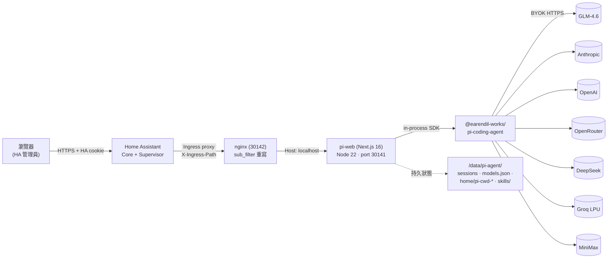
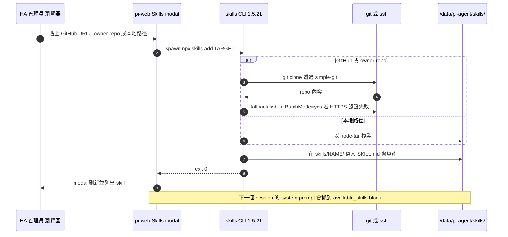
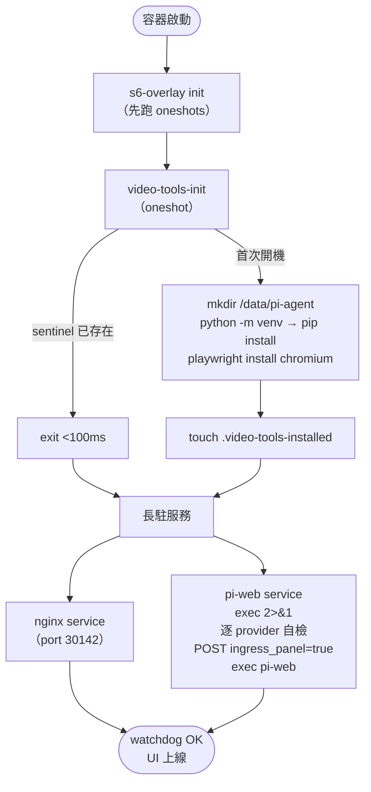

<p align="center">
  
</p>

<h1 align="center">Woow HA Pi Agent 附加元件</h1>

<p align="center">
  <b>將 <a href="https://github.com/agegr/pi-web">pi-web</a> 工作區打包成 Home Assistant Supervisor 附加元件，內建 7 家推理服務。</b><br/>
  <sub>GLM · MiniMax · OpenAI · OpenRouter · Anthropic · DeepSeek · Groq — BYOK，全部可選，最少啟用一家即可。</sub>
</p>

<p align="center">
  <a href="https://github.com/WOOWTECH/Woow_ha_pi_agent_add_on/releases"></a>
  
  
  
  
  
  
</p>

<p align="center">
  <a href="#快速上手">快速上手</a> ·
  <a href="#功能總覽">功能</a> ·
  <a href="#架構">架構</a> ·
  <a href="#畫面截圖">截圖</a> ·
  <a href="#設定">設定</a> ·
  <a href="#skills-技能系統">技能</a> ·
  <a href="#相關套件">套件</a> ·
  <a href="#安全性">安全</a> ·
  <a href="#疑難排解">排障</a> ·
  <a href="README.md">English</a>
</p>

---

## 概觀

**Woow HA Pi Agent** 是單一個 Home Assistant Supervisor 附加元件，內建 [`@agegr/pi-web`](https://www.npmjs.com/package/@agegr/pi-web) —— [pi coding agent](https://github.com/earendil-works/pi) 的瀏覽器工作區 —— 並預先接上七家推理服務。安裝一次、貼上金鑰，全 HA 管理員即可在側欄開啟，每個 session 自由挑選模型。

- **零開埠安裝。** UI 走 HA Ingress，不需動 LAN 或防火牆。
- **BYOK、並列比對。** GLM-4.6、Claude Opus 4.7、Groq Llama 可在同一介面切換比較。
- **狀態隨升級保留。** Session、models.json、skill worktree 全部落在 `/data/pi-agent/`，隨 HA 快照備份。
- **內建 skill store。** UI 直接從 GitHub URL、`owner/repo` 或本地路徑安裝技能（v0.12.0 已把 `git`+`openssh-client` 打進映像檔）。
- **影片產線。** ffmpeg + Playwright + edge-tts + rclone 全部預裝，可直接跑 `pitch_video` 工作流（v0.11.0）。
- **Watchdog。** Supervisor 探測 `/api/home`，卡死自動重啟。

## 快速上手

| 步驟 | 動作 |
|---:|---|
| 1 | **設定 → 附加元件 → 附加元件商店 → ⋮ → 儲存庫** |
| 2 | 加入 `https://github.com/WOOWTECH/Woow_ha_pi_agent_add_on`，安裝 **Woow HA Pi Agent** |
| 3 | 開啟 **設定** 頁，貼上 **至少一家** 服務的 API 金鑰後儲存 |
| 4 | **啟動** 後，從 HA 側欄的 **Pi Agent** 進入（僅管理員可見） |

新安裝約 10 秒後就能在側欄看到入口。詳細各家服務說明請看 [`DOCS.md`](DOCS.md)。

## 功能總覽

### 服務目錄（v0.12.0）

| 服務 | API 模式 | 代表模型 | 為什麼 |
|---|---|---|---|
| **GLM-4.6**（智譜清言） | `openai-completions` + `thinkingFormat: "zai"` | `glm-4.6` | 中國區推理模型、支援 thinking blocks、價格具競爭力 |
| **MiniMax M3** | `openai-completions` + `thinkingFormat: "deepseek"` | `MiniMax-M2` / `abab7-chat-preview` | 超長上下文（最高 1M）、便宜草稿層 |
| **OpenAI** | `openai-completions` | `gpt-4o` / `gpt-4o-mini` | 基準線、支援影像輸入 |
| **OpenRouter** | `openai-completions` | `anthropic/claude-sonnet-4` · `openai/gpt-4o` · `deepseek/deepseek-chat` · `meta-llama/llama-3.3-70b-instruct` | 一把金鑰通用多家、便宜備援 |
| **Anthropic direct** | `anthropic` | `claude-opus-4-7` · `claude-sonnet-4-6` · `claude-haiku-4-5` | 原生 thinking blocks + `cache_control`（走 OpenRouter 會遺失兩者） |
| **DeepSeek direct** | `openai-completions` | `deepseek-chat` · `deepseek-reasoner`（R1） | 比 OpenRouter 便宜；R1 原生 thinking tokens 完整 |
| **Groq** | `openai-completions` | `llama-3.3-70b-versatile` · `kimi-k2-instruct` | LPU 服務（約 500 tok/s）、便宜快速草稿層 |

只有設定過金鑰的服務會啟用。開機自檢會對每一家設定過的服務發一次 `max_tokens=1` 探測，並逐行輸出 `HTTP 200 / 401 / 402 / 429 / 000` 到 Logs 頁 —— 壞金鑰在幾秒內就能被抓到，不必等第一次聊天。

### 執行與運維

- **In-process SDK。** `pi-web` 直接 import `@earendil-works/pi-coding-agent`，單一 Node 行程處理 UI + 推理。
- **HA Ingress + 側欄自動啟用。** 不公開任何 port；首次開機自動 POST Supervisor API 開啟側欄圖示（v0.8.0 修正）。
- **s6-overlay supervisor。** `nginx`（前端）+ `pi-web`（後端）+ `video-tools-init`（oneshot）。
- **冪等 seed。** `models.json` 後續開機以 `jq` 合併新加入的 provider；使用者的手動編輯永遠優先保留。
- **Worktree 永續化。** `HOME=/data/pi-agent/home`，`pi-cwd-*/` 與已安裝的 skill 都能撐過映像檔升級（v0.10.0）。
- **冷備份策略。** `backup_exclude` 排除可重建的 cache（`playwright-cache/`、`venv/`、`**/clips/**`、`**/segments/**`），快照保持精簡；`rclone.conf` 留在快照內，還原後 Google Drive token 仍可用。

## 架構

### 執行拓撲



**為什麼把 nginx 擺在 pi-web 前面：** 上游會出絕對路徑資產（`/_next/...`、`/api/...`、`/manifest.webmanifest`、`/icons/*`），而 HA Ingress 每個安裝都會把 URL 前綴改掉。nginx 層透過 `sub_filter` 位元組級重寫，再加上塞進 `</head>` 的 JS shim，把 `fetch`、`EventSource`、`XMLHttpRequest`、`history.pushState/replaceState`、`Element.setAttribute` 以及屬性 setter（`href`/`src`）通通包起來 —— React 的 DOM 寫入、RSC prefetch、`next/font` runtime 注入、`router.push('/')` 全部會走進 ingress 前綴，不會漏到 HA Core。`X-Ingress-Path` header 在進 body-rewrite 前會先過白名單驗證（`^/api/hassio_ingress/[A-Za-z0-9_-]{16,128}$`），防止上游 proxy 設定錯誤讓 client 塑形 header（v0.7.0 收斂的 CVE 類）。

### Skill 安裝流程（v0.12.0）



**為什麼要在 base image 裡帶 `git` + `openssh-client`：** `skills` CLI 對每一種 repo 安裝路徑（Skills modal 的 Search 按鈕、`owner/repo` 縮寫、`skills.sh` 內指向 repo 的條目）都會透過 `simple-git` 呼叫 `git clone`。少了 `git` 會讓 99% 的安裝失敗（`spawn git ENOENT` —— 就是 v0.12.0 上線的那個事件）。`openssh-client` 讓 CLI 對私有 repo 的 `ssh -o BatchMode=yes` 重試路徑生效。`gh` 刻意不裝（20 MB+，只在被吞掉的 `gh auth token` fallback 用得到）。

### s6-overlay 開機序列



完整架構寫在：[`docs/ARCHITECTURE.md`](docs/ARCHITECTURE.md)。

## 畫面截圖

以下都是從 WoowTech HA（`woowtech-ha.woowtech.io`）實機抓的畫面。

### Home Assistant 整合

|  |  |
|:---:|:---:|
| **側欄圖示（僅管理員）。** `panel_admin: true` 鎖住這個入口，每次開機透過 Supervisor API 自動啟用 —— 新安裝不必去找「顯示於側欄」開關。 | **附加元件 Info 頁。** 顯示版本、主機名稱、「Open Web UI」按鈕（Ingress 路由）以及標準 Supervisor 控制項。 |
|  |  |
| **設定頁。** 7 個 `password?` 欄位全可選。空欄位 = 該服務略過。至少要有一把金鑰，否則附加元件會拒絕啟動（會在 log 留一行 fatal）。 | **Logs 頁。** 逐 provider 自檢輸出（`HTTP 200 / 401 / 402 / 429 / 000`）—— 壞金鑰幾秒內出現，不必等第一次聊天。 |

### pi-web 工作區

|  |  |
|:---:|:---:|
| **主工作區。** 新 session 撰寫框、模型下拉、模式選擇 —— 全部嵌在 HA iframe 內，沒有任何看得見的 ingress 管線。 | **Session 檢視。** 推理逐字稿、tool-call 區塊、inline diff 的呈現和獨立 pi-web 一模一樣。 |
|  |  |
| **Skills modal。** 從 GitHub URL、`owner/repo` 或本地路徑加入 —— v0.12.0 的修正（`git`+`openssh-client` 進 image）解鎖了所有 repo 型安裝路徑。 | **Models 面板。** 即時編輯 `/data/pi-agent/models.json` —— 新增 provider、改模型名稱、調 `contextWindow`/`maxTokens` 都不用重啟附加元件。 |

|  |
|:---:|
| **`<available_skills>` block 出現在 system prompt。** Skill 探測在 session 開始時發生 —— `/data/pi-agent/skills/` 下每個 `SKILL.md` 的 `description` frontmatter 都會被塞進去，讓模型知道什麼情境該叫什麼 skill。撰寫 description 時請用命令式的「Use when…」句型。 |

## 設定

| 選項 | 必填 | 說明 |
|---|---|---|
| `api_key` | 否† | GLM 金鑰，取自 `open.bigmodel.cn` |
| `minimax_api_key` | 否† | MiniMax 金鑰，取自 `api.minimax.io` |
| `openai_api_key` | 否† | OpenAI 金鑰，取自 `platform.openai.com` |
| `openrouter_api_key` | 否† | OpenRouter 金鑰，取自 `openrouter.ai` |
| `anthropic_api_key` | 否† | Anthropic 金鑰，取自 `console.anthropic.com` |
| `deepseek_api_key` | 否† | DeepSeek 金鑰，取自 `platform.deepseek.com` |
| `groq_api_key` | 否† | Groq 金鑰，取自 `console.groq.com` |

† **至少要有一把**。schema 都宣告為 `password?`，HA 會當作 secret 存放，不會在 UI 明文顯示。

### 首次開機 bootstrap

`/data/pi-agent/models.json` 會依下列 provider 優先順序，用第一個有金鑰的當作 seed：

`GLM → Anthropic → OpenAI → OpenRouter → DeepSeek → Groq → MiniMax`

後續開機若又補上其他 provider 金鑰，會透過冪等 `jq` 合併進去 —— **使用者的手改優先**（改模型名、刪 provider、加 custom 條目全部保留）。只有把整份 `models.json` 刪掉，才會重新觸發 seed。

參考設定範例放在 [`examples/models/`](examples/models/)：
- [`glm-only.json`](examples/models/glm-only.json) —— 最小的 GLM-4.6（附 `thinkingFormat: "zai"`）
- [`multi-provider.json`](examples/models/multi-provider.json) —— 完整 5 家 provider 版型

## Skills 技能系統

Skill 預設為 user-scope —— `PI_CODING_AGENT_DIR/skills/` 下每個資料夾一個 skill（附加元件把這個路徑釘在 `/data/pi-agent/skills/`，讓 skill 撐過映像檔升級）。

```
/data/pi-agent/skills/hello-world/
├── SKILL.md            ← 必要，frontmatter 決定被探測到
└── scripts/greet.sh    ← 從 SKILL.md 引用
```

三種安裝路徑，都能從 **pi-web → Skills → Add skill** 走到：

1. **GitHub URL** —— `https://github.com/owner/repo`（支援 branch 與子路徑）
2. **`owner/repo` 縮寫** —— 展開等同上面
3. **本地路徑** —— 從附加元件的可寫掛載中複製

最小範例 skill 放在 [`examples/skills/hello-world/`](examples/skills/hello-world/)。把整個資料夾丟進 `/data/pi-agent/skills/hello-world/`（或用 pi-web Add-skill 的本地路徑選項），下一個 session 的 `<available_skills>` block 就會看到它。

寫 `description` 時請用命令式的「Use when…」句型 —— 那就是 pi 模型會看到的原字串。

## 相關套件

執行時期由以下套件組成（全部包在 image 內）：

| 套件 | 版本 | 角色 |
|---|---|---|
| [`@agegr/pi-web`](https://www.npmjs.com/package/@agegr/pi-web) | `0.8.4`（釘死） | Next.js 16 瀏覽器工作區 —— 走 nginx 從 port 30141 對外 |
| [`@earendil-works/pi-coding-agent`](https://www.npmjs.com/package/@earendil-works/pi-coding-agent) | transitive | pi SDK —— pi-web 直接 in-process import，沒有獨立 daemon |
| [`skills`](https://www.npmjs.com/package/skills) | `1.5.21` | Add-skill 用的 CLI；會 shell 出 `git` / `ssh` / `gh` |
| `simple-git` | 隨 `skills` | 包裝 `git clone` 給 repo 型安裝 |
| `node-tar` | 隨 `skills` | tarball 型安裝的解壓 |
| Node.js | `22.x`（nodesource） | Runtime —— pi-web 需 ≥22.19.0 |
| nginx | Debian bookworm | Ingress 前端；sub_filter 重寫；白名單驗 `X-Ingress-Path` |
| ffmpeg + ffprobe | Debian bookworm | 影片產線（v0.11.0）—— segment、xfade、字幕燒錄 |
| Chromium runtime `.so` set | Debian bookworm | Playwright 用的瀏覽器（實際 binary 落在 `/data/pi-agent/playwright-cache/`） |
| edge-tts / pyyaml / mutagen | Python venv | `pitch_video` 用的 TTS 與 timeline 生成 |
| rclone | 取自 `downloads.rclone.org` 的當代 .deb | Google Drive 上傳 |
| s6-overlay | 隨 `hassio-addons/debian-base:9.1.0` | 服務 supervisor |

**釘版本的理由。** `@agegr/pi-web` 釘死（非 `@latest`），因為上游丟了 40+ 條硬編的 `/api/*` 路由與絕對路徑資產，nginx shim 完全靠這些形狀運作。上游若重構 `_next` chunk 名、RSC prefetch 形狀、或新增 `/api/*` 路由，都可能讓 shim 在無 code change 的情況下悄悄壞掉。要升級請人工做完 e2e 驗證再 bump。

### 容器映像

Multi-arch 映像由 [`.github/workflows/build.yml`](.github/workflows/build.yml) 建置後推到 GHCR：

- `ghcr.io/woowtech/woow-ha-pi-agent-amd64:<version>`
- `ghcr.io/woowtech/woow-ha-pi-agent-aarch64:<version>`

Base：`ghcr.io/hassio-addons/debian-base:9.1.0`。

## 安全性

| 層 | 保證 | Trust boundary |
|---|---|---|
| HA Ingress | 只有經 HA 驗證的使用者才能打到 `/api/hassio_ingress/<token>/*` | HA session cookie |
| 側欄圖示 | 僅管理員（`panel_admin: true`） | HA admin 角色 |
| `X-Ingress-Path` | 進 body-rewrite 前先過白名單（`^/api/hassio_ingress/[A-Za-z0-9_-]{16,128}$`） | 對抗上游 proxy 設定錯誤的縱深防禦 |
| API 金鑰 | 存在 `/data/options.json`（Supervisor 管理）；宣告為 `password?`；透過 `$*_API_KEY` env 傳給 pi | HA 主機檔案系統 |
| pi-web 應用層驗證 | **沒有。** 存取控制交給 HA。 | 有 HA admin 權限 = 完整 pi-web 權限 |
| `rclone.conf` | 留在 HA 快照內（跟 cache 不同），還原後 Drive token 仍可用 | HA 備份加密 |

若你需要 pi-web 自己的使用者級驗證，請在 HA 前面掛 auth-proxy —— 不要試著在 pi-web 內加 auth（ingress 層在 pi-web 看到 header 之前就把它們剝掉了）。

## 測試

- **開機自檢** —— 每個設定過的 provider 都以 `max_tokens=1` 探測一次，結果逐行寫進 log。
- **HA Supervisor watchdog** —— 週期性探測 `http://[HOST]:[PORT:30142]/api/home`，卡死自動重啟。
- **End-to-end 驗證節奏。** 每個 tag 出前跑：(a) 全新安裝 → 側欄圖示可見 → 第一次聊天成功；(b) Skills → 從 GitHub URL 加 skill → skill 出現在 `<available_skills>`；(c) `pitch_video` dry-run 過 `python video/verify.py`。錄下來的 fixture 放在 [`tests/`](tests/)。

## 疑難排解

| 症狀 | 原因 / 修法 |
|---|---|
| 附加元件無法啟動，log 說「No provider key configured」 | 打開設定頁，貼上至少一把金鑰後儲存再啟動 |
| UI 上線但每次聊天都 `401 身份验证失败` | 金鑰錯了。從 Logs 頁看逐 provider 自檢那行，找出是哪家 —— 換掉那家的金鑰 |
| 聊天返回 `402` / `429` | 驗證成功但沒額度 / 被限流。儲值或從 Models 下拉切另一家 |
| 「Open Web UI」按鈕 404 | `ha core restart`；ingress token 偶爾需要 Supervisor 重新登錄 panel |
| iframe 空白、network 顯示 `/_next/...` 404 | nginx sub_filter 或 shim 出問題。`ha addons logs b9cf5676_woow_ha_pi_agent` 抓 nginx error；確認 request 上有 `X-Ingress-Path` |
| 全新安裝找不到側欄圖示 | 從 Info 頁手動切「顯示於側欄」開關（慢速 Supervisor 上，那個 POST 偶爾會 race） |
| Skills → Add 失敗 `spawn git ENOENT` | v0.12.0 之前的 image。升到 ≥0.12.0 —— `git` + `openssh-client` 現在都在 image 裡 |
| 附加元件升級後 worktree 不見 | v0.10.0 之後不該發生。若從 ≤v0.9.1 升上來，舊 worktree 原本在 ephemeral rootfs —— 這次請在 `HOME=/data/pi-agent/home` 底下重建 |
| 影片產線跑到一半失敗 | `rm /data/pi-agent/.video-tools-installed`，再重啟附加元件 —— `video-tools-init` 會重下 venv + Chromium |

完整排障清單看 [`DOCS.md`](DOCS.md#troubleshooting)。

## 開發

### 目錄

```
Woow_ha_pi_agent_add_on/
├── config.yaml              附加元件 manifest —— arch、ingress、watchdog、schema
├── build.yaml               Multi-arch build args
├── Dockerfile               Debian base → Node 22 → ffmpeg/rclone → pi-web 釘版
├── DOCS.md                  HA 附加元件 info 頁顯示的使用者文件
├── CHANGELOG.md             每個 release，含 rationale（0.1.0 → 0.12.0）
├── README.md                英文版
├── README_zh-TW.md          本檔
├── repository.yaml          HA add-on 儲存庫 manifest
├── rootfs/                  s6-overlay 服務樹 + nginx conf + init 腳本
│   ├── etc/s6-overlay/
│   │   ├── s6-rc.d/pi-web/run
│   │   ├── s6-rc.d/nginx/run
│   │   └── scripts/video-tools-init
│   └── etc/nginx/           nginx.conf + sub_filter 規則 + 注入 shim
├── examples/
│   ├── ha/panel_iframe.yaml       側欄 pin 的 YAML 設定
│   ├── models/glm-only.json       最小單一 provider 版
│   ├── models/multi-provider.json 完整 5 家 provider 版
│   └── skills/hello-world/        參考 skill 樣板
├── docs/
│   ├── ARCHITECTURE.md      深度解析 —— 行程模型、ingress shim、備份
│   └── screenshots/         README 與 docs 用的 PNG
├── tests/                   Boot / self-check / ingress smoke test
└── .github/workflows/build.yml    Multi-arch GHCR publish
```

### 本機建置

```bash
docker buildx build \
  --build-arg BUILD_FROM=ghcr.io/hassio-addons/debian-base-amd64:9.1.0 \
  --build-arg BUILD_ARCH=amd64 \
  --build-arg BUILD_VERSION=0.12.0-dev \
  -t local/woow-ha-pi-agent-amd64:0.12.0-dev .
```

### 升 pi-web

編輯 `Dockerfile`：

```dockerfile
ARG PI_WEB_VERSION=0.8.4   # ← 改這行
```

然後跑完整 e2e 再打 tag —— shim 依賴上游確切的 asset 形狀。

## 支援

- **Issue / feature request** —— [github.com/WOOWTECH/Woow_ha_pi_agent_add_on/issues](https://github.com/WOOWTECH/Woow_ha_pi_agent_add_on/issues)
- **上游 pi-web** —— [github.com/agegr/pi-web](https://github.com/agegr/pi-web)
- **上游 pi coding agent** —— [github.com/earendil-works/pi](https://github.com/earendil-works/pi)
- **Skills CLI** —— [github.com/anthropics/skills](https://github.com/anthropics/skills)（上游 `skills` npm 套件）

## 授權

MIT © [WOOWTECH](https://github.com/WOOWTECH)。完整條款見 [`LICENSE`](LICENSE)。

打包的上游套件各自保留原授權（`@agegr/pi-web` MIT、`@earendil-works/pi-coding-agent` MIT、`skills` MIT、ffmpeg LGPL/GPL 依 build 而定、Chromium BSD、rclone MIT）。

---

<p align="center">
  <sub>由 <a href="https://github.com/WOOWTECH">WOOWTECH</a> 打造 · 內建 <a href="https://github.com/earendil-works/pi">pi</a> · 由 <a href="https://www.home-assistant.io/">Home Assistant</a> 承載</sub>
</p>
