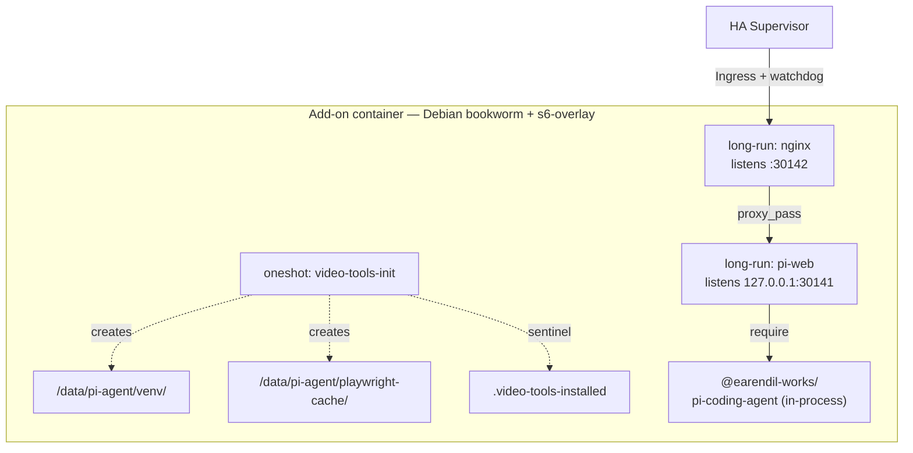

# Architecture

Deep dive into how the Woow HA Pi Agent add-on is put together. If you only need the user-facing overview, see [`../README.md`](../README.md). If you're troubleshooting a specific symptom, see [`../DOCS.md`](../DOCS.md#troubleshooting).

## 1. Process model

One container, three s6-overlay services:



- **`video-tools-init`** — oneshot. On first boot creates the Python venv, installs `playwright` / `edge-tts` / `pyyaml` / `mutagen`, and runs `playwright install chromium`. Guarded by `/data/pi-agent/.video-tools-installed`; subsequent boots exit in <100 ms. Non-fatal: pi-web starts in parallel and chat stays functional even if this fails.
- **`nginx`** — long-run. Serves port `30142` (the `ingress_port` in `config.yaml`). Does `sub_filter` byte-level asset-URL rewriting and validates `X-Ingress-Path` before letting it into any body template.
- **`pi-web`** — long-run. Node 22 Next.js server on `127.0.0.1:30141`. Imports `@earendil-works/pi-coding-agent` as a library — there is no separate agent daemon. On start it: merges `SUPERVISOR_TOKEN`-based POST to enable the sidebar tile, runs the per-provider self-check, then `exec pi-web`.

The `pi-web/run` script also does `exec 2>&1` at the top so anything the Node process writes to stderr shows up in the addon Logs tab (previously stderr was silently dropped by the s6 log service — v0.8.0).

## 2. HA Ingress layer

### Why nginx is in front

pi-web ships absolute-path assets: `/_next/static/...`, `/api/...`, `/favicon.ico?<hash>`, `/manifest.webmanifest`, `/icons/apple-touch-icon.png`, `/sw.js?v=0.8.4`, etc. HA Ingress rewrites the URL prefix per install (`/api/hassio_ingress/<token>/`), so the browser must resolve every asset against that prefix — not against HA Core.

nginx handles this on the wire (before the browser sees the HTML) via `sub_filter`. Every response has these text substitutions applied:

| Match | Replacement |
|---|---|
| `href="/_next/` | `href="$safe_ingress_path/_next/` |
| `src="/_next/` | `src="$safe_ingress_path/_next/` |
| `href="/favicon` | `href="$safe_ingress_path/favicon` |
| `href="/manifest` | `href="$safe_ingress_path/manifest` |
| `href="/icons/` | `href="$safe_ingress_path/icons/` |

`$safe_ingress_path` is a `map` over `$http_x_ingress_path` that only keeps the header if it matches the whitelist:

```nginx
map $http_x_ingress_path $safe_ingress_path {
    default "";
    "~^/api/hassio_ingress/[A-Za-z0-9_-]{16,128}$" $http_x_ingress_path;
}
```

If a misconfigured upstream proxy lets a client send `X-Ingress-Path`, it will not match the regex, `$safe_ingress_path` collapses to `""`, and the sub_filter rules become a no-op. The result is a broken page for that user — not a stored XSS across other users (v0.7.0).

### The `</head>` shim

Byte-level `sub_filter` covers static asset URLs, but Next.js also builds URLs at runtime:

- `fetch("/api/...")` from client code
- `EventSource("/api/sessions/xxx/stream")` for chat SSE
- `router.push("/")` → `new URL(pathname, location.origin)` → `fetch(URL, ...)` for RSC prefetch
- `ReactDOM.preinit()` / `next/font` runtime injects `<link href="/_next/...">`
- `history.pushState("...", "", "/foo")` for client-side nav

nginx injects a JS shim into `</head>` that wraps all of these:

1. **`fetch`** — accepts `string` / `URL` / `Request`; normalizes each via `S(u)` (strips leading `location.origin`) → `T(u)` (checks if the path is one of pi-web's known prefixes: `/api/`, `/_next/`, `/favicon`, `/manifest`, `/icons/`, `?_rsc=`) → prepends `window.__INGRESS_PATH__`.
2. **`EventSource`** — same normalization on the URL arg (SSE for chat streaming).
3. **`XMLHttpRequest.prototype.open`** — same normalization.
4. **`history.pushState` / `history.replaceState`** — normalize the URL arg so `router.push('/foo')` writes an ingress-prefixed history entry.
5. **`Element.prototype.setAttribute`** — intercepts `href=` / `src=` writes so React DOM updates get normalized (fires after hydration, when React does `setAttribute` writes rather than SSR baked-in `<link>` tags).
6. **`HTMLLinkElement.href` / `HTMLScriptElement.src` / `HTMLImageElement.src` property setters** — same normalization for direct property assignment (the other path React can take).
7. **`navigator.serviceWorker.register`** — no-op stub that returns a fake `ServiceWorkerRegistration` shape (pi-web 0.8.4 registers `/sw.js?v=0.8.4` with `{scope: "/"}` — under ingress this either 404s or crosses the ingress boundary; PWA offline isn't useful for a local-network tool, so we silently disable).

The shim's `T()` predicate is the source of truth for "which paths belong to pi-web". Adding a new upstream-injected `<link>` category (e.g., a new PWA-related file in a future pi-web) means adding one line to `T()`.

### Hostname rewriting

pi-web has an `isApiRequestAllowed()` guard that compares the incoming `Host:` against a whitelist. Under ingress the browser sends the HA hostname, which is not in pi-web's whitelist. nginx rewrites `Host: localhost` before `proxy_pass`, so the guard passes without any whitelist config. This is why the `extra_allowed_hosts` option was removed in v0.10.0 — it had been a no-op since v0.6.0.

## 3. Provider layer

`models.json` is the sole source of truth for enabled providers and models. Layout:

```jsonc
{
  "providers": {
    "<id>": {
      "baseUrl": "https://…",
      "api": "openai-completions" | "anthropic",
      "apiKey": "$SOME_ENV_VAR",           // resolved at request time
      "thinkingFormat": "zai" | "deepseek", // optional
      "models": [ { "id": "…", "name": "…", "reasoning": true, "input": ["text","image"], "contextWindow": 200000, "maxTokens": 8192 } ]
    }
  }
}
```

### Idempotent seeding

On boot, `pi-web/run` runs a `jq` merge:

1. If `/data/pi-agent/models.json` doesn't exist, seed with the first provider that has a key in priority order `GLM → Anthropic → OpenAI → OpenRouter → DeepSeek → Groq → MiniMax`.
2. Merge every other provider whose key is set — but only if `providers.<id>` is not already in the file. **User edits win.** Removing a provider from `models.json` will not resurrect it.

Keys are always referenced from JSON as `$GLM_API_KEY` / `$OPENAI_API_KEY` / etc. The value is resolved from the environment at request time (not baked into the file), so rotating a key in the Configuration tab takes effect after restart without any file edit.

### Boot self-check

Each configured provider gets one `max_tokens=1` probe:

| Provider | Endpoint | Model | Auth header |
|---|---|---|---|
| GLM | `/chat/completions` | `glm-4-flash` | `Authorization: Bearer` |
| MiniMax | `/text/chatcompletion_v2` | `abab6.5s-chat` | `Authorization: Bearer` |
| OpenAI | `/chat/completions` | `gpt-4o-mini` | `Authorization: Bearer` |
| OpenRouter | `/chat/completions` | `openai/gpt-4o-mini` | `Authorization: Bearer` |
| **Anthropic** | `/messages` | **`claude-haiku-4-5`** | `x-api-key` + `anthropic-version` |
| DeepSeek | `/chat/completions` | `deepseek-chat` | `Authorization: Bearer` |
| Groq | `/chat/completions` | `llama-3.3-70b-versatile` | `Authorization: Bearer` |

Anthropic's special path: `x-api-key` + `anthropic-version` (not `Authorization: Bearer`), and the probe uses **Haiku** because Sonnet/Opus reject `max_tokens=1`. Result mapping:

| HTTP | Meaning | User action |
|---|---|---|
| `200` | Provider OK | none |
| `401` / `403` | Wrong key | fix in Configuration |
| `402` / `429` | Auth OK, out of credits or rate-limited | refill or use another provider |
| `000` | Network / DNS unreachable | check egress firewall / DNS |
| other | Unusual response, chat may fail | check log line for detail |

Non-fatal — the UI always boots so the user can open Configuration and fix a bad key.

## 4. Persistent state

All state lives under `/data/pi-agent/` (a `map: addon_config` mount, backed up by HA snapshots):

| Path | Contents | Excluded from backup? |
|---|---|---|
| `sessions/*.jsonl` | One file per conversation | no |
| `models.json` | Provider + model registry | no |
| `auth.json` | OAuth tokens for `/login`-configured providers | no |
| `home/pi-cwd-*/` | pi coding-agent worktrees (`HOME=/data/pi-agent/home`) | `node_modules/` + `.cache/` yes |
| `skills/<name>/` | Installed skills (`PI_CODING_AGENT_DIR` pinned) | no |
| `venv/` | Python venv for video pipeline | **yes** — rebuildable |
| `playwright-cache/` | Chromium binary | **yes** — rebuildable |
| `projects/*/clips/`, `projects/*/segments/` | Video intermediates | **yes** — rebuildable |
| `projects/*/final.mp4` | Video pipeline output | no |
| `rclone/rclone.conf` | Google Drive OAuth token | **no** — losing this breaks every push |

The `backup_exclude` list in `config.yaml` is the source of truth. Rationale in comments: caches under 5 min to rebuild are excluded to keep snapshots small; anything that requires user interaction to regenerate (like OAuth tokens) stays inside.

## 5. Skills subsystem

Skills are discovered at session start. The pi coding agent reads `PI_CODING_AGENT_DIR/skills/*/SKILL.md`, parses the `name` / `description` frontmatter, and injects an `<available_skills>` block into the system prompt. The `description` is the exact string the model sees — write it imperatively ("Use when the user asks to…").

### Install paths (all reachable from **pi-web → Skills → Add skill**)

- **GitHub URL** — `https://github.com/owner/repo` or `https://github.com/owner/repo/tree/branch/subpath`. `skills` CLI calls `git clone` via `simple-git`. Requires `git` in the image (fixed in v0.12.0).
- **`owner/repo` shorthand** — expands to the same code path.
- **Local path** — copies via `node-tar`.
- **skills.sh entry** — declarative one-line install spec (repo URL or local path). Same underlying code paths.

The v0.12.0 fix is a one-line Dockerfile change (`git openssh-client` added to the apt install list). Rationale: `spawn git ENOENT` was blocking every repo-backed install; `openssh-client` enables the CLI's `ssh -o BatchMode=yes` fallback for private repos over SSH; `gh` intentionally omitted (20 MB+, only used for a swallowed `gh auth token` fallback that the CLI ignores).

### Persistence pin

The addon exports `PI_CODING_AGENT_DIR=/data/pi-agent` so installed skills live under `/data/pi-agent/skills/`. Without this pin, skills would land in the pi coding agent's default home dir on the ephemeral container root fs — and vanish on every image update (same class of bug as pre-v0.10.0 worktrees).

## 6. Video pipeline (v0.11.0+)

Two-tier install to keep image size flat across upgrades:

### Baked in (~300 MB gzipped, `Dockerfile`)

- `python3` + `python3-venv` + `python3-pip`
- `ffmpeg` (+ `ffprobe`, `libass`, `libx264`, `aac`)
- `fonts-noto-cjk` + `fonts-noto-color-emoji` + `fontconfig` — subtitle burn under CJK/emoji scripts (nothing else covers 中/日/韓 in libass)
- Chromium runtime `.so` set: `libnss3` `libatk-bridge2.0-0` `libcups2` `libxcomposite1` `libxdamage1` `libxrandr2` `libgbm1` `libpango-1.0-0` `libcairo2` `libasound2` `libatspi2.0-0`
- `rclone` (current .deb from `downloads.rclone.org` — Debian's bookworm package is a year behind)
- `git` + `openssh-client` (v0.12.0, for skill install)

### First-boot download (~720 MB, `video-tools-init` oneshot)

- Python venv with `playwright`, `edge-tts`, `pyyaml`, `mutagen` → `/data/pi-agent/venv/`
- Chromium browser binary via `PLAYWRIGHT_BROWSERS_PATH=/data/pi-agent/playwright-cache` → `/data/pi-agent/playwright-cache/`

Guarded by `/data/pi-agent/.video-tools-installed`. Subsequent boots exit in <100 ms.

### Env inheritance

`pi-web/run` exports:

| Var | Value | Purpose |
|---|---|---|
| `PATH` (prefix) | `/data/pi-agent/venv/bin` | `python3` / `playwright` / `edge-tts` resolve to venv |
| `PLAYWRIGHT_BROWSERS_PATH` | `/data/pi-agent/playwright-cache` | Playwright locates the persistent Chromium |
| `RCLONE_CONFIG` | `/data/pi-agent/rclone/rclone.conf` | `rclone` uses the persistent OAuth token |

`/etc/profile.d/pi-agent.sh` mirrors the same three for interactive shells (addon Terminal tab / `docker exec`), so the pi coding agent can spawn arbitrary shells and they all pick up the venv without sourcing anything.

## 7. Watchdog

`config.yaml`:

```yaml
watchdog: "http://[HOST]:[PORT:30142]/api/home"
```

HA Supervisor probes that URL periodically. If the response is non-200 (or the connection times out), it restarts the add-on. `/api/home` was chosen because it's the only pi-web route that answers `200` on a fresh install with no session context. nginx proxies it through without auth.

Ingress SSE streaming: `ingress_stream: true` in `config.yaml` disables Supervisor's default 60 s buffering on the ingress connection — long chat responses would otherwise time out mid-generation.

## 8. Multi-arch build

`.github/workflows/build.yml` runs on tag push and builds for both architectures via `docker buildx`:

- `linux/amd64` → `ghcr.io/woowtech/woow-ha-pi-agent-amd64:<version>`
- `linux/arm64` → `ghcr.io/woowtech/woow-ha-pi-agent-aarch64:<version>`

`build.yaml` declares the arch-specific `BUILD_FROM` (both point at `hassio-addons/debian-base` for the respective arch). The Dockerfile is arch-agnostic apart from the rclone .deb download, which uses `dpkg --print-architecture` to pick the right binary.

## 9. Versioning discipline

- **pi-web** — pinned via `ARG PI_WEB_VERSION=0.8.4` in `Dockerfile`. Never `@latest`. Bump only after e2e-validating a new upstream release (the shim depends on upstream's exact asset shape — an unnoticed change to `_next` chunk names, RSC prefetch shape, or a new `/api/*` route will silently regress the shim).
- **skills CLI** — resolved transitively at install time (`npx skills add`). Verified against 1.5.21 that only `git` / `ssh` / `gh` are shelled out to; extraction is `node-tar`. No submodule / lfs paths.
- **Base image** — `ghcr.io/hassio-addons/debian-base:9.1.0`. Bumped when the upstream ships a security fix that outweighs the risk of a base rebuild changing behavior.

## 10. Where to look when something breaks

| Symptom | First place to look |
|---|---|
| Addon won't boot | `ha addons logs b9cf5676_woow_ha_pi_agent` — self-check line names the failing provider |
| UI blank / assets 404 | Browser DevTools Network tab — check the path shape; grep for missing `X-Ingress-Path` in nginx access log |
| Chat opens but never responds | pi-web log for the SSE error; verify `ingress_stream: true` is in `config.yaml` |
| Add-skill fails | Confirm image is ≥v0.12.0; `which git openssh-client` inside the container |
| Video step fails | `cat /data/pi-agent/.video-tools-installed`; if missing, `video-tools-init` failed — check its log lines |
| Watchdog restart loop | pi-web crash on start; probably a bad `models.json` after a manual edit |

For the full history of every fix and its rationale, see [`../CHANGELOG.md`](../CHANGELOG.md) — every entry from 0.1.0 to 0.12.0 documents both what changed and why.
